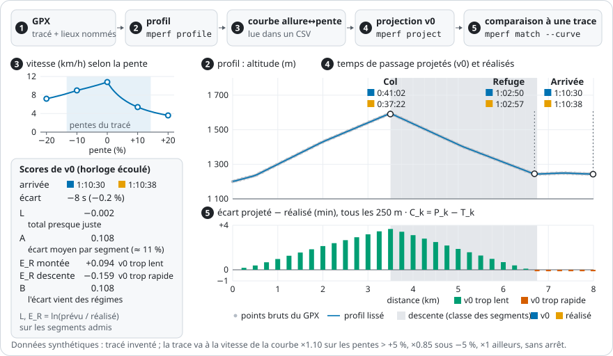

# mountain-performance-analysis

Analyse de données de sport de montagne et modélisation de la performance.

Premier outil : projeter les temps de passage sur un tracé GPX à partir de la
courbe allure↔pente de l'athlète, et valider ces projections contre des
performances réelles. Aujourd'hui, `mperf` construit le profil d'un GPX, y projette
des temps de passage avec une courbe lue dans un fichier, et apparie une trace
réalisée à un tracé pour en calculer les scores. En Python, pour un usage
personnel d'abord ; le dépôt ne contient aucune donnée personnelle.



*La chaîne de bout en bout, produite par le code de `main` (`just figure`), sur des données entièrement synthétiques. Un tracé inventé est rééchantillonné et lissé (profil) ; le moteur v0 y projette les temps de passage à partir d'une courbe allure↔pente synthétique, à effort constant, sans effet de régime ni fatigue. Une trace réalisée inventée — 10 % plus rapide que la courbe en montée, 15 % plus lente en descente, sans arrêt — est appariée au tracé. À l'arrivée, le temps total est presque juste ; pourtant le réalisé avait plusieurs minutes d'avance au col : les erreurs se compensent. Les métriques du backtest ([`0010`](docs/decisions/0010-protocole-de-backtest.md), D7.2) les font apparaître : l'écart moyen par segment `A` est grand alors que l'écart global `L` est presque nul, et il vient entièrement de la différence entre régimes (`B`, `E_R`). C'est le protocole de mesure qui voit ces erreurs, pas le modèle. Les nombres illustrent la mesure, pas une performance du modèle.*

## Pourquoi

Les règles classiques sont les mêmes pour tous les coureurs : Naismith, par
exemple, compte 5 km/h plus 1 h par 600 m de D+. Ici, la vitesse vient d'une
courbe vitesse = f(pente) propre à l'athlète, appliquée pas à pas le long du tracé.

- **Livré (moteur v0)** : `v = pace(pente) × effort`, avec un effort constant et
  sans dégradation : ni fatigue, ni altitude, ni chaleur. La courbe est lue dans
  un fichier ; la construire depuis les données Garmin de l'athlète est prévu au
  M6b.
- **Prévu (M6a)** : la dégradation au fil de la course, dont la fatigue en
  descente selon la **profondeur** de la descente en cours, pas seulement selon
  l'avancement.

Un effet n'entrera dans le modèle que s'il fait baisser l'erreur mesurée par le
backtest, ou avec une justification écrite. Le backtest comparera aussi v0 à des
modèles de référence (vitesse constante, Naismith, Tobler :
[`0010`](docs/decisions/0010-protocole-de-backtest.md), D9).

## Installation

Prérequis : [`uv`](https://docs.astral.sh/uv/) et `git` ; Python 3.12 ou plus (uv l'installe au besoin).

```bash
git clone git@github.com:rdwk2/mountain-performance-analysis.git
cd mountain-performance-analysis
uv tool install rust-just   # la commande `just`
uv sync --locked            # .venv et dépendances, aux versions de uv.lock
just check                  # lint + types + tests : doit être vert
```

Aucune dépendance de calcul : la seule dépendance d'exécution est `tzdata`, sous
Windows. `just check` enchaîne trois recettes :

| Recette | Ce qu'elle lance |
|---|---|
| `just lint` | `ruff check`, puis `ruff format --check` |
| `just types` | `mypy` strict sur `src/`, `tests/` et `scripts/` |
| `just test` | `pytest` |

`just fmt` formate et corrige ; `just dictionary` régénère
[`docs/DICTIONNAIRE_DONNEES.md`](docs/DICTIONNAIRE_DONNEES.md). La CI
([`.github/workflows/ci.yml`](.github/workflows/ci.yml)) lance `just check` sur
une machine vierge à chaque push et à chaque pull request.

`MPA_DATA_DIR`, le dossier des données personnelles hors du dépôt, sert au seul
backtest enregistré (`just backtest` : manifeste, courbe, registre, rapports) ;
les autres commandes ne le lisent pas.
Pour le renseigner, copier [`.env.example`](.env.example) en `.env` ;
`just` charge `.env` s'il existe. Sous Windows, écrire le chemin avec des barres
obliques.

## Utilisation : `mperf`

Quatre sous-commandes, installées par `uv sync`. Les exemples ci-dessous ont été
exécutés depuis la racine du dépôt, sur des fixtures synthétiques commitées
([`tests/fixtures/`](tests/fixtures/README.md)) ; celui du backtest, sur le monde
synthétique que les tests écrivent dans un dossier temporaire.

### `mperf profile` — le profil d'un GPX

Lit un GPX, le rééchantillonne sur une grille à pas fixe, lisse l'altitude et
résout les lieux nommés (`<wpt>`) le long du tracé.

```bash
uv run mperf profile tests/fixtures/mini_11.gpx
```

```text
fichier      mini_11.gpx   sha256 7fdb9d12…
lecture      11 points, 0 écartés (doublons), 1 tronçon
grille       1 000 m, 21 points, pas 50 m
lissage      150 m demandé → 150 m effectif (3 points)
dénivelé     D+ 44 m / D− 44 m        (brut : D+ 50 m / D− 50 m)
points       2 résolus sur 2, 0 <wpt> sans nom ignoré(s)
```

| Option | Rôle | Défaut |
|---|---|---|
| `--step-m F` | pas de la grille (m) | 50 |
| `--smoothing-m F` | fenêtre de lissage de l'altitude (m) ; 0 = aucun lissage | 150 |
| `--max-offset-m F` | écart maximal d'un lieu au tracé pour retenir un passage (m) | 150 |
| `--min-separation-m F` | séparation minimale des passages (m) ; 0 = aucune contrainte | 500 |
| `--csv` | la grille sur stdout : `distance_m,elevation_m,grade` | — |

Les défauts du pas et du lissage sont provisoires : leur validation sur des
fichiers réels est différée.

### `mperf project` — les temps de passage

Projette des temps de passage sur un GPX, avec le moteur v0
([`0009`](docs/decisions/0009-moteur-projection-v0.md)).

```bash
uv run mperf project tests/fixtures/mini_11.gpx --curve tests/fixtures/courbe_synthetique.csv
```

```text
fichier      mini_11.gpx   sha256 7fdb9d12…
courbe       courbe_synthetique.csv   sha256 6767dd38…
             3 activités, 2026-01-01 → 2026-01-31
grille       1 000 m, 21 points, pas 50 m
lissage      150 m demandé → 150 m effectif (3 points)
support      9 tranches lues, 5 retenues (>= 10 min), plage −20 % … +20 %
             pentes rencontrées : −10 % … +10 %
             hors support : 0 % de la distance, 0 % du temps
effort       1.00
durée        0:08:30   (D+ 44 m / D− 44 m)
passages     4   (2 lieux résolus, départ et arrivée synthétisés)
      0 m   Départ                 0:00:00
      0 m   Départ                 0:00:00
    500 m   Col                    0:05:14
  1 000 m   Arrivée                0:08:30
```

Le départ et l'arrivée sont toujours synthétisés, même quand le GPX porte déjà un
lieu à ces abscisses : d'où deux lignes « Départ » à 0 m, le départ synthétisé
puis le lieu nommé de `mini_11.gpx` (docstring de `project` dans
[`model/engine.py`](src/mountain_perf/model/engine.py), test
`test_start_and_finish_are_synthesised_even_over_a_named_place` de
[`tests/test_model_engine.py`](tests/test_model_engine.py)).

| Option | Rôle | Défaut |
|---|---|---|
| `--curve fichier.csv` | courbe allure↔pente, **obligatoire**, avec son compagnon `<nom>.meta.json` à côté | — |
| `--effort F` | facteur multiplicatif sur la vitesse ; 1 = la référence des activités qui ont construit la courbe | 1.0 |
| `--min-support-min F` | données minimales par tranche de pente pour la retenir (min) ; 0 = aucun filtre | 10 |
| `--step-m`, `--smoothing-m`, `--max-offset-m`, `--min-separation-m` | comme pour `profile` | |
| `--csv` | le tableau des passages sur stdout, durées en secondes | — |

Colonnes du CSV : `name`, `distance_m`, `elevation_m`, `arrival_s`,
`departure_s`, `moving_time_s`, puis `segment_duration_s`, `segment_distance_m`,
`segment_ascent_m`, `segment_descent_m`, qui décrivent le tronçon **qui précède**
le passage (vides sur la première ligne).

### `mperf match` — une trace réalisée face à un tracé

L'outil d'appariement du backtest, selon le protocole
[`0010`](docs/decisions/0010-protocole-de-backtest.md) : apparie une trace
réalisée (GPX horodaté) à un tracé de référence. Le rapport donne les points de
score (sections 1 à 4), puis les segments, la couverture, le préfixe comparable,
les horloges et les épisodes d'arrêt (5 à 9), puis les passages nommés (10).

```bash
uv run mperf match tests/fixtures/appariement_reference.gpx tests/fixtures/appariement_trace_x01.gpx
```

```text
référence    appariement_reference.gpx   sha256 48132bc6…
             L 530 m, D+/km 0 m/km
trace        appariement_trace_x01.gpx
             33 enregistrements, 0 instant dupliqué écarté, écoulé 0:05:20, 1 bloc, 0 trou
départ       ancré — b_0 25.00 m, durée avant départ 0:00:00
arrivée      ancré — instant 0:05:20, b_K 505.00 m, L − b_K 25.00 m
points       Δ 250 m, ε 30 m, r_c 15 m — 4 points
             trouvé 2, ancré 2, ambigu 0, absent 0, hors ε 0, tangente indéfinie 0
             ambigus : aucun
segments     3 admis sur 3
             borne non observée 0 (0.00 m), trou 0 (0.00 m)
             rapport de longueur 0 (0.00 m), écart intérieur 0 (0.00 m)
             ancrage exclu 50.00 m
couverture   90.57 % — montée non évalué, plat 90.57 %, descente non évalué
             écoulé admis 0:05:20
             temps exclus : trou 0:00:00, rapport de longueur 0:00:00, écart intérieur 0:00:00
             durées inconnues : 0 segment
préfixe      3 segments, b_m 505.00 m, t*_m 0:05:20, dernier passage aucun
horloges     M / S / U de la trace, puis du support admis
             θ1  trace 0:04:20 / 0:00:00 / 0:01:00   admis 0:04:20 / 0:00:00 / 0:01:00
             θ2  trace 0:04:20 / 0:00:00 / 0:01:00   admis 0:04:20 / 0:00:00 / 0:01:00
             θ3  trace 0:04:20 / 0:00:00 / 0:01:00   admis 0:04:20 / 0:00:00 / 0:01:00
             θ4  trace 0:04:20 / 0:00:00 / 0:01:00   admis 0:04:20 / 0:00:00 / 0:01:00
             θ5  trace 0:04:20 / 0:00:00 / 0:01:00   admis 0:04:20 / 0:00:00 / 0:01:00
             θ_bas θ1, θ_haut θ1, I_sens,A [0:04:20 ; 0:05:20]
épisodes     sous θ_c : 0 épisode, 0:00:00
passages     0 occurrence — trouvé 0, ancré 0, ambigu 0, absent 0, hors ε 0, tangente indéfinie 0, hors préfixe 0 ; comparables 0
             épisodes θ_c : attribués 0, sans candidate 0, non attribués 0
```

Avec `--curve`, le rapport ajoute les scores de v0 brut (sections 11 à 13) : les
scénarios usage et contrôle, les métriques sous chaque horloge du rapport, les
écarts `C_k` aux points et la cible d'usage `K`. Pour rejouer l'exemple complet :

```bash
uv run mperf match tests/fixtures/appariement_reference.gpx tests/fixtures/appariement_trace_x01.gpx --curve tests/fixtures/courbe_synthetique.csv
```

Extrait : les dix lignes qui suivent les sections 1 à 10 ci-dessus (section 11,
puis début de la section 12).

```text
v0 brut      courbe courbe_synthetique.csv   sha256 6767dd38…
             effort 1.00, moteur projection-v0 ; horloges du rapport : écoulé, M θ1, (M+U) θ1
usage        appariement_reference.gpx ; 3 segments admis : montée 0, plat 3, descente 0, mixte 0
             enveloppe       support [−0.693147 ; −0.485508], min |L| 0.485508
                             montée non évalué
                             plat [−0.693147 ; −0.485508], min |L| 0.485508
                             descente non évalué
                             mixte non évalué
                             écoulé              M θ1                (M+U) θ1
             L               −0.693147           −0.485508           −0.693147
```

| Option | Rôle | Défaut |
|---|---|---|
| `--delta-m F` | Δ, pas de la grille de score (m) | 250 |
| `--eps-m F` | ε, tolérance latérale et d'ancrage (m) | 30 |
| `--curve courbe.csv` | courbe allure↔pente : ajoute les scores de v0 brut | — |
| `--no-reference` | sortie sans référence : la référence doit être la trace elle-même (`0010` D3) | — |

Le rayon de regroupement `r_c` n'a pas d'option : il reste à son défaut, 15 m.

### `just backtest` — le backtest enregistré de v0 brut

`just backtest <courbe.csv>` lance `mperf backtest` sur le manifeste
`MPA_DATA_DIR/reference/manifeste.json` et la courbe nommée, du même dossier
([`0010`](docs/decisions/0010-protocole-de-backtest.md), D14 et D15) : sorties
retenues, domaine et performances ; appariement et scores de v0 brut de chaque sortie ;
référence de répétabilité de chaque parcours. L'exécution est enregistrée dans
`MPA_DATA_DIR/registre/` (une DÉCLARATION avant le calcul, puis un RÉSULTAT ou un
ÉCHEC) ; le rapport complet est écrit dans `MPA_DATA_DIR/rapports/backtest-<n° du
RÉSULTAT>.txt`, jamais réécrit ; la synthèse s'affiche, avec l'empreinte de la dernière
ligne du registre, à recopier au journal. La commande refuse un arbre de travail
modifié : elle enregistre le commit du code exécuté.

```bash
just backtest courbe.csv
```

Extrait de la synthèse, sur le monde synthétique des tests
(`tests/fixtures/backtest_world.py`) : une ligne par sortie déclarée, puis les
agrégats d'usage sous l'écoulé, à poids égal par performance et par jeu.

```text
performances jour        sortie                      jeu            étiquette     couverture  préfixe    L           q_usage
             2026-06-03  a-2026-06-03                répétabilité   entraînement  100.00 %    4.26 km    +0.018701   0.032531
             2026-06-04  b-2026-06-04                répétabilité   entraînement  100.00 %    3.64 km    +0.045858   0.044823
             2026-06-06  a-2026-06-06                répétabilité   entraînement  100.00 %    4.26 km    −0.081382   0.081224
             2026-06-08  b-2026-06-08                répétabilité   entraînement  100.00 %    3.64 km    +0.084860   0.081359
             2026-06-10  a-2026-06-10                répétabilité   entraînement  88.26 %     2.75 km    +0.057051   support insuffisant
             2026-06-12  a-2026-06-12                répétabilité   entraînement  100.00 %    4.26 km    −0.002133   0.014189 (jour multi-sorties)
             2026-06-12  b-2026-06-12                répétabilité   entraînement  99.96 %     3.64 km    +0.015959   0.015832 (jour multi-sorties)
             2026-06-12  libre-2026-06-12            développement  entraînement  100.00 %    2.62 km    +0.025011   sans référence (jour multi-sorties)
             2026-06-14  a-2026-06-14                développement  course        100.00 %    4.26 km    +0.132283   0.136219
             2026-06-15  libre-2026-06-15            développement  entraînement  100.00 %    2.63 km    +0.007733   sans référence
             2026-06-16  c-2026-06-16                développement  entraînement  non scorée : trace refusée (c16.gpx) : c16.gpx, trkpt[0].time : instant manquant.
             2026-06-20  a-2026-06-20                développement  entraînement  non scorée : sortie non tracée
             2026-06-25  b-2026-06-25                confirmation   entraînement  99.96 %     3.64 km    +0.104660   0.099369
             2026-06-27  a-2026-06-27                confirmation   entraînement  100.00 %    4.26 km    +0.066124   0.078102
agrégats     usage, écoulé ; moyenne à poids égal par performance (effectif) ; détail et motifs : rapport complet
                             répétabilité        développement       confirmation
             L               +0.025018 (5)       +0.132283 (1)       +0.085392 (2)
```

| Option de `mperf backtest` | Rôle | Défaut |
|---|---|---|
| `--curve courbe.csv` | courbe allure↔pente, **obligatoire** : une entrée déclarée de l'exécution | — |
| `--descent-threshold F` | seuil des descentes roulantes et raides (diagnostic de `0010` D6), dans [0,60 ; 1] | 0,80 |

## État et plan

Jalons M0 à M3 livrés ; M4 (backtest) en cours.

- le plan, jalon par jalon : [`docs/ROADMAP.md`](docs/ROADMAP.md) ;
- ce qui a été fait, session par session : [`docs/JOURNAL.md`](docs/JOURNAL.md) ;
- les idées en attente : [`BACKLOG.md`](BACKLOG.md).

## Décisions et documents

Une décision structurante = un fichier dans [`docs/decisions/`](docs/decisions/),
sur le gabarit [`0000-template.md`](docs/decisions/0000-template.md). Toutes
sont au statut « acceptée », sauf 0013 (« proposée ») :

- [0001 — Séparation stricte données / code](docs/decisions/0001-separation-data-code.md)
- [0002 — Unités internes et unités d'affichage](docs/decisions/0002-unites.md)
- [0003 — Portée multi-sport des contrats](docs/decisions/0003-portee-multi-sport.md)
- [0004 — Le point remarquable comme pivot](docs/decisions/0004-point-remarquable-pivot.md)
- [0005 — Convention des temps de passage](docs/decisions/0005-convention-temps-de-passage.md)
- [0006 — Le temps](docs/decisions/0006-temps.md)
- [0007 — Forme des données](docs/decisions/0007-forme-des-donnees.md)
- [0008 — Géométrie, lissage et résolution des passages](docs/decisions/0008-geometrie-et-lissage.md)
- [0009 — Moteur de projection v0](docs/decisions/0009-moteur-projection-v0.md)
- [0010 — Protocole de backtest et métrique d'erreur](docs/decisions/0010-protocole-de-backtest.md)
- [0011 — Bibliothèques de la piste analyse](docs/decisions/0011-bibliotheques-analyse.md)
- [0012 — Notebooks et règle 7](docs/decisions/0012-notebooks-et-regle-7.md)
- [0013 — Ingestion des activités et format d'`interim/`](docs/decisions/0013-ingestion-et-interim.md)

Autres documents :

- [`docs/MODELE_V1.md`](docs/MODELE_V1.md) — la spécification de départ du
  modèle, reprise de la version précédente du projet ; le M3 n'en implémente que
  la partie 1 ;
- [`docs/DICTIONNAIRE_DONNEES.md`](docs/DICTIONNAIRE_DONNEES.md) — les contrats de
  données, généré depuis les docstrings ;
- [`docs/PIEGES_DATA.md`](docs/PIEGES_DATA.md) — les pièges déjà rencontrés dans
  les données Garmin ;
- [`docs/analyse/`](docs/analyse/) — la charte et les questions de la piste analyse ;
- [`CLAUDE.md`](CLAUDE.md) — les règles et les conventions du dépôt.

## Données

Ce dépôt ne contient aucune donnée personnelle (règle 1 de [`CLAUDE.md`](CLAUDE.md),
décision [`0001`](docs/decisions/0001-separation-data-code.md)). Les données
réelles vivent hors du dépôt, dans le dossier désigné par `MPA_DATA_DIR`. Les tests
et les exemples ci-dessus n'utilisent que les fixtures synthétiques de
[`tests/fixtures/`](tests/fixtures/README.md).
